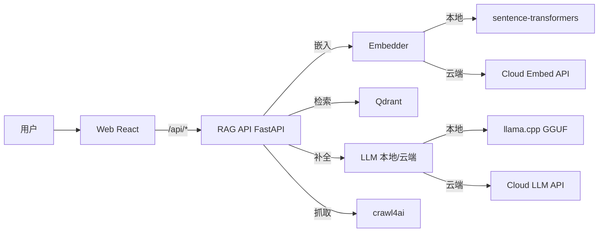

# 架构设计 · MorningStar AI

> 作者：晨星

## 1. 设计原则

| 原则 | 落地方式 |
|------|----------|
| 混合推理 | 本地 GGUF 优先，云端 OpenAI 兼容兜底（自动降级） |
| 本地优先 | 数据默认不出本机；云端为可选 |
| 容器化 | `docker-compose` 一键编排 |
| 零黑盒 | 分块 / RRF 融合有纯 Python 单测 |

## 2. 组件图

## 3. 数据流（一次问答）

1. 用户输入问题 → Web 发 `POST /api/chat`（SSE 流式）。
2. RAG API 用 Embedder 把问题转为向量。
3. VectorStore（Qdrant 或内存兜底）返回 top-K 片段。
4. 双路排序：**稠密（向量余弦）** + **词法（lexical overlap）**，经 **倒数排名融合 RRF** 合成最终片段集。
5. 片段注入提示词，交给 LLM 生成答案；本地不可用时降级云端。
6. 答案以 SSE `data: {token}` 逐字回流前端。

## 4. 模块职责

| 模块 | 文件 | 职责 |
|------|------|------|
| 配置 | `app/config.py` | 环境变量集中读取 |
| 嵌入 | `app/embeddings.py` | 本地/云端/确定性兜底三态 |
| 向量库 | `app/vector_store.py` | Qdrant 优先，内存兜底 |
| 大模型 | `app/llm.py` | 本地 + 云端 FallbackLLM |
| RAG 编排 | `app/rag.py` | 分块 / RRF / 提示词 / 检索 |
| 接口 | `app/main.py` | FastAPI 端点 |

## 5. 关键不变量（单测守护）

- `chunk_text`：长文本必分块；相邻 chunk 词交叠（overlap）。
- `reciprocal_rank_fusion`：融合保序、结果去重。
- `HashEmbedder`：相同文本 → 相同向量；L2 模长 = 1（确定性、可复现）。

## 6. 可扩展性

- 换模型：改 `.env` 的 `LLM_MODEL_NAME` / `EMBED_MODEL`，无需改代码。
- 加 Agent：在 `RAGService.answer` 上挂工具调用循环即可。
- 多租户：以 `COLLECTION` 隔离知识空间。
